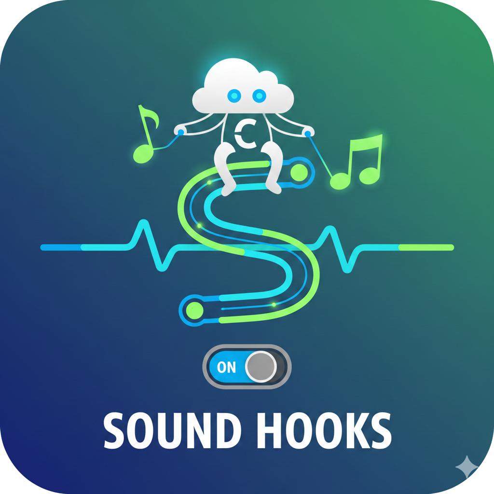

# Claude Sounds Toggle

A one-click macOS desktop app to pause and resume sound hooks in [Claude Code](https://claude.ai/claude-code).



## What it does

Claude Code supports hooks that play sounds on events like session start, notifications, and session end. This app lets you toggle those sounds on/off instantly from your Desktop or Dock — no terminal needed.

Each click shows a self-dismissing alert:
- `🔇 Claude Sounds paused` — sounds are silenced
- `🔊 Claude Sounds resumed` — sounds are back on

## How it works

The app creates or removes a flag file at `~/.claude/sounds-paused`. The Claude Code hooks check for this file before playing any audio.

## Does the file check add any delay?

No — the check is imperceptible. `[ -f ~/.claude/sounds-paused ]` is a simple filesystem existence check that takes microseconds. `afplay` itself has 50–100ms of startup overhead before any sound is heard, which completely dwarfs the file check. The entire hook also runs in the background (`&`), so it never blocks Claude Code regardless.

## Setup

### 1. Configure Claude Code hooks

Add the following to `~/.claude/settings.json`, updating paths to match your sounds directory. If you want the folder hidden from `ls`, prefix its name with a dot (e.g. `.sounds`):

```json
{
  "hooks": {
    "SessionStart": [
      {
        "matcher": "startup",
        "hooks": [
          {
            "type": "command",
            "command": "[ -f ~/.claude/sounds-paused ] || afplay /path/to/sounds/session-start.mp3 &"
          }
        ]
      }
    ],
    "SessionEnd": [
      {
        "matcher": "",
        "hooks": [
          {
            "type": "command",
            "command": "[ -f ~/.claude/sounds-paused ] || afplay /path/to/sounds/session-end.mp3 &"
          }
        ]
      }
    ],
    "Notification": [
      {
        "matcher": "",
        "hooks": [
          {
            "type": "command",
            "command": "[ -f ~/.claude/sounds-paused ] || afplay /path/to/sounds/notification.mp3 &"
          }
        ]
      }
    ]
  }
}
```

### 2. Build the app

Open Terminal and run:

```bash
osacompile -o ~/Desktop/ClaudeSounds.app ClaudeSounds.applescript
```

This creates `ClaudeSounds.app` on your Desktop. You can drag it into your Dock for quick access.

### 3. Set a custom icon (optional)

Convert your PNG to ICNS and replace the default icon inside the app bundle:

```bash
# Create the iconset
mkdir -p /tmp/claude_icon.iconset
sips -z 16 16     /path/to/icon.png --out /tmp/claude_icon.iconset/icon_16x16.png
sips -z 32 32     /path/to/icon.png --out /tmp/claude_icon.iconset/icon_16x16@2x.png
sips -z 32 32     /path/to/icon.png --out /tmp/claude_icon.iconset/icon_32x32.png
sips -z 64 64     /path/to/icon.png --out /tmp/claude_icon.iconset/icon_32x32@2x.png
sips -z 128 128   /path/to/icon.png --out /tmp/claude_icon.iconset/icon_128x128.png
sips -z 256 256   /path/to/icon.png --out /tmp/claude_icon.iconset/icon_128x128@2x.png
sips -z 256 256   /path/to/icon.png --out /tmp/claude_icon.iconset/icon_256x256.png
sips -z 512 512   /path/to/icon.png --out /tmp/claude_icon.iconset/icon_256x256@2x.png
sips -z 512 512   /path/to/icon.png --out /tmp/claude_icon.iconset/icon_512x512.png
sips -z 1024 1024 /path/to/icon.png --out /tmp/claude_icon.iconset/icon_512x512@2x.png

# Convert to ICNS and replace the app's icon
iconutil -c icns /tmp/claude_icon.iconset -o /tmp/claude_icon.icns
cp /tmp/claude_icon.icns ~/Desktop/ClaudeSounds.app/Contents/Resources/applet.icns

# Restart Finder to clear the icon cache
killall Finder
```

## Requirements

- macOS
- Claude Code with hook support
- Sound files in a directory of your choice (`.mp3` or `.aiff`)
